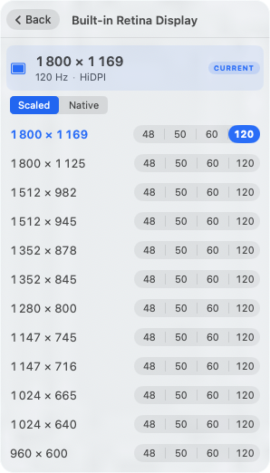

# VibeRes

A modern menubar resolution switcher for macOS. Native SwiftUI, multi-display profiles, Shortcuts.app integration, sibling CLI. Spiritual successor to the abandoned [EasyRes](http://easyres.softwar.io/).

> **macOS 26 Tahoe**, Apple Silicon. (Backporting [notes below](#older-macos).)

[](https://github.com/m-moravcik/VibeRes/actions/workflows/ci.yml)


| Root | Detail | Save profile |
|---|---|---|
|  |  |  |

---

## Install

Download `VibeRes-*.zip` from [Releases](https://github.com/m-moravcik/VibeRes/releases), unzip into `/Applications`, then on first launch right-click → **Open** (ad-hoc signed). Or:

```bash
xattr -dr com.apple.quarantine /Applications/VibeRes.app
```

---

## Switch resolution

Click the menu-bar icon, click a display, click a resolution. Refresh rates appear as inline pill chips — click a chip to pick that exact rate, click the row body for the highest available. Hover any non-current row for a geometric preview and a `+12% / −16%` real-estate badge.

NTSC drop-frame variants (59.94, 47.95) are deduplicated against integer counterparts.

---

## Profiles

A **profile** is a named multi-display preset. Save once, switch with one click.

The save form is a per-display checklist. For each external display you choose **Specific monitor** (default — locked to that exact monitor by EDID) or **Any external monitor** (matches whichever non-built-in screen is connected — useful for "Presentation" mode that should work with any projector). Built-in is always specific. Excluded displays are left untouched, so a "Code" profile can touch only the laptop and ignore externals.

Pill icons telegraph the type:

- `[🖥 Work]` — specific
- `[🖥 Presentation ✱]` — flexible (any external)
- `[💻 Code]` — built-in only

When applied, a small note shows the outcome: green = exact, orange = closest available (e.g. *"LG UltraFine: wanted 2560×1440 @75Hz, used 2560×1440 @60Hz"*), red = display not connected. Profiles match by EDID so they survive reboots and USB-C reconnects.

---

## CLI — `viberes`

Same Core code as the GUI, same profile store.

```bash
make install-cli   # → /usr/local/bin/viberes
```

```bash
viberes list                              # all displays + current mode
viberes modes <display>                   # available modes
viberes set <display> <WxH[@Hz][-hidpi|-native]>

viberes profile list
viberes profile show <name>
viberes profile save <name> [--any-external] [--only <display>...]
viberes profile apply <name>              # exit 2 on any fallback or skip
viberes profile rename <old> <new>
viberes profile delete <name>
```

`<display>` is a case-insensitive substring of the display name or its numeric ID. Examples:

```bash
viberes set "Built-in" 1800x1169@120
viberes set LG 2560x1440-native
viberes profile save Presentation --any-external
viberes profile save Code --only Built-in
viberes profile apply Presentation
# # applied profile "Presentation"
#   ✓ Built-in Retina Display → 1280×800 @60Hz
#   ~ LG UltraFine: wanted 1920×1080 @60Hz, used 1920×1080 @60Hz (closest available)
```

---

## Shortcuts.app

Two AppIntents auto-register with Shortcuts, Spotlight, and Siri:

- **Set Display Resolution** — pick display + width + height (+ optional refresh, HiDPI). Closest-match scoring.
- **Get Current Resolution** — for conditional workflows.

Combine with Shortcuts.app's global hotkeys for keyboard-driven switching. Stream Deck / BTT / Loupedeck inherit it for free since they all trigger Shortcuts.

---

## Build

```bash
brew install xcodegen
make app          # GUI
make cli          # viberes binary
make test         # 48 tests, 8 suites, Swift Testing
```

`project.yml` is the source of truth — `*.xcodeproj` is regenerated and not committed.

---

## Older macOS

| Target | Effort |
|---|---|
| **macOS 15 Sequoia** | Lower deployment target. As-is. |
| **macOS 14 Sonoma** | As-is. Test thoroughly. |
| **macOS 13 Ventura** | Replace `@Observable` with `ObservableObject` (~30 lines). |
| **macOS 12 Monterey or older** | Substantial rewrite (no `MenuBarExtra`, no AppIntents, legacy login item). Not planned. |

---

## License

MIT — see [LICENSE](./LICENSE). Inspired by EasyRes by Chris Miles.
