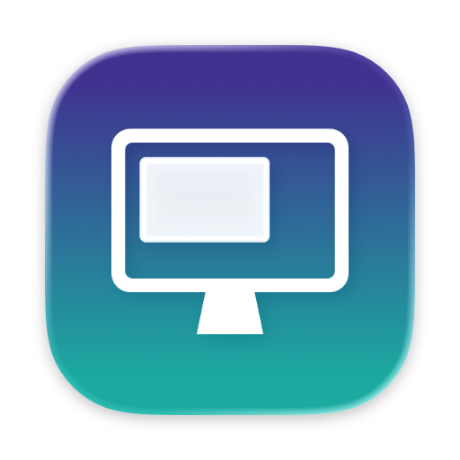
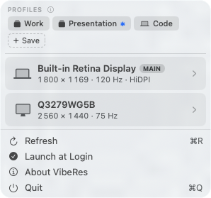
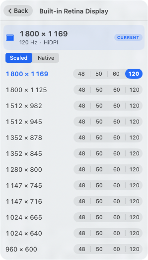
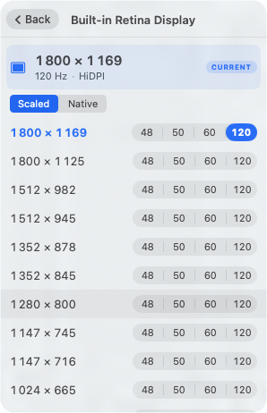

<p align="center"></p>

# VibeRes

A modern menubar resolution switcher for macOS. Native SwiftUI, live hover preview, multi-display profiles, Shortcuts.app integration, and a sibling CLI. Spiritual successor to the abandoned [EasyRes](http://easyres.softwar.io/).

> Requires **macOS 26 Tahoe**. Universal binary — developed and tested on Apple silicon, and the Intel slice ships for the Macs Tahoe still supports. See [Older macOS](#older-macos) for backporting notes.

[](https://github.com/m-moravcik/VibeRes/actions/workflows/ci.yml)


---

## Install

### Homebrew (recommended)

```bash
brew install --cask m-moravcik/viberes/viberes-app   # GUI menu-bar app
brew install        m-moravcik/viberes/viberes       # CLI companion
```

Upgrade later: `brew upgrade --cask m-moravcik/viberes/viberes-app` and `brew upgrade m-moravcik/viberes/viberes`. The Cask drops the quarantine attribute on install so Gatekeeper doesn't prompt on first launch. Both formula and cask live in [m-moravcik/homebrew-viberes](https://github.com/m-moravcik/homebrew-viberes).

### Manual

If you don't use Homebrew, download `VibeRes-*.zip` from [Releases](https://github.com/m-moravcik/VibeRes/releases) and unzip it into `/Applications`. Releases are Developer ID signed, notarized and stapled, so a normal double-click works — no right-click → **Open** dance.

### Build from source

```bash
make install-cli   # → /usr/local/bin/viberes
```

Or use Xcode (`make app`) — see [Build](#build) below.

---

## Switching resolution

Click the menu-bar icon. The popover shows every connected display with its current mode.

<p align="center"></p>

Click a display card to drill in. Each row is one logical size; refresh rates appear as a segmented control on the right. Click anywhere on the row to apply the highest available rate, or click a specific rate. The current size is highlighted in accent colour with a **CURRENT** pill at the top.

<p align="center"></p>

**Scaled vs Native.** The toggle at the top switches between two families of modes:

- **Scaled** is the default for built-in Retina displays. macOS renders at high DPI and downsamples to the panel's physical pixel grid, so text stays sharp at any "Looks like" size. This is what System Settings → Displays calls "Looks like 1800 × 1169" — the number is the *visual* size, not the framebuffer.
- **Native** is 1:1 pixel mapping — one logical point per physical pixel. Useful for non-Retina externals where scaling adds nothing but wastes GPU time.

VibeRes deduplicates NTSC drop-frame variants (59.94, 47.95) against their integer counterparts (60, 48) automatically.

### Preview on hover

Hover any row other than the current one and a small sketch appears in the top-right corner of the list: the thin outline is the mode you're on, the filled rectangle inside it is the mode you're about to pick, both drawn at the same scale — so shrinking and growing read the same way. It sits in a fixed corner instead of following the cursor, which is deliberate: a popover anchored to the hovered row kept eating the first click and lagging behind fast pointer movement.

The row's tooltip carries what a rectangle can't say — mode family, true pixel count, and the change in screen space: *"Scaled (HiDPI) · 3456 × 2234 pixels · +12% screen space"*.

**Live preview** *(off by default)* fills that inner rectangle with a real screenshot of the display, cropped to the proposed aspect ratio, so you see *which part of your desktop survives the switch* rather than just how big the box gets. Enable it in **Settings → Preview → Live preview on hover**; macOS asks for Screen Recording the first time, and the app tells the system why.

It is deliberately frugal with that permission: one still per display view you open — never a continuous capture stream — cached while the popover is open and dropped when it closes. The screenshot is rendered on your Mac and never leaves it. If the permission is denied or a capture fails, the preview quietly falls back to the plain outline version; see [Troubleshooting](#live-preview-keeps-re-prompting-for-screen-recording) if the prompt keeps coming back.

---

## Profiles

A profile is a named multi-display preset. Save once, switch with one click. The save form is a per-display checklist:

<p align="center"></p>

For each external display you choose:

- **Specific monitor** *(default)* — locked to that exact monitor by EDID. Survives reboots and USB-C reconnects on the same physical hardware.
- **Match any external monitor** — the entry binds by role, not identity. Use it for a "Presentation" profile that should work with whatever projector or hotel TV you plug into.

Built-in is always specific. Excluded displays are left untouched, so a "Code" profile can touch only the laptop and ignore externals.

Pill icons telegraph the type at a glance. `[🖥 Work]` is locked to specific monitors, `[🖥 Presentation ✱]` carries the small `✱` badge that means *"this profile travels"*, `[💻 Code]` uses the laptop icon when the profile only touches the built-in. The profile that matches what the displays are currently doing is highlighted with a checkmark and an accent border — that one is *on*, the others are one click away.

When you click a pill, a coloured note shows the outcome: green for an exact match, orange when the closest available mode was used as a fallback (e.g. *"LG UltraFine: wanted 2560 × 1440 @ 75 Hz, used 2560 × 1440 @ 60 Hz (closest available)"*), red when a target display isn't connected.

### Editing a profile

Right-click any pill to apply, update, rename, or delete. Delete asks first — there is no undo for a profile, and `⌘Z` undoes display changes, not profile ones. **Update with current setup** rewrites the profile's saved resolutions from whatever the displays are currently doing — useful when you've fine-tuned the setup and want to overwrite the snapshot without losing the profile's identity. **Make flexible / Make specific** flips external entries between EDID-locked and "any external" without recreating the profile. When saving or editing, you can optionally choose which display becomes main (hosts the menu bar) when the profile applies; the default "Don't change" keeps today's behaviour. For a one-off change without a profile, drill into a display and hit **Make main display** — the menu bar moves there, relative positions stay put, and Revert takes it back.

---

## Command-line companion

VibeRes ships with `viberes`, a sibling executable that links the same Core code as the GUI. Same profile store, same `CGDisplay` APIs, same scoring. See [Install](#install) above for `brew` and `make` paths.

Reference:

```text
viberes list                              List displays + current mode
viberes modes <display>                   Show available modes
viberes current [<display>]               Print current mode (one or all)
viberes set <display> <WxH[@Hz][-hidpi|-native]>
                                          Switch to closest matching mode

viberes profile list
viberes profile show <name>
viberes profile save <name> [--any-external] [--only <display>...]
viberes profile apply <name>              Per-display outcome (exit 2 on fallback)
viberes profile update <name>             Refresh from current state
viberes profile flex <name>               Toggle specific ↔ flexible externals
viberes profile rename <old> <new>
viberes profile delete <name>
```

`<display>` is a case-insensitive substring of the display name *or* its numeric ID (`1`, `3`, etc.). `<name>` is a profile name (case-insensitive) *or* the id `viberes profile list` prints. Profile names are unique, so a name always identifies one profile — a catalog saved by an older version could hold duplicates, and those are reported rather than guessed between. Examples:

```bash
viberes set "Built-in" 1800x1169@120
viberes set LG 2560x1440-native
viberes profile save Presentation --any-external
viberes profile save Code --only Built-in
viberes profile apply Presentation
# # applied profile "Presentation"
#   ✓ Built-in Retina Display → 1280×800 @60Hz
#   ~ LG UltraFine: wanted 1920×1080 @60Hz, used 1920×1080 @60Hz (closest available)
```

Exit code is `0` for full success, `2` if anything fell back or was skipped. Easy to drop into shell pipelines or git hooks.

---

## Shortcuts.app

Two AppIntents auto-register with Shortcuts, Spotlight, and Siri:

- **Set Display Resolution** — pick a display + width + height (+ optional refresh and HiDPI preference). Closest-match scoring.
- **Get Current Resolution** — for conditional workflows ("if my MacBook is at 1800×1169, switch to 1280×800").

Once registered, you can assign a global hotkey to any Shortcut from Shortcuts.app's settings — pressing it from anywhere in the system flips the relevant displays. Stream Deck, BetterTouchTool, and Loupedeck inherit it for free since they all trigger Shortcuts.

---

## Build

```bash
brew install xcodegen
make app          # GUI
make cli          # viberes binary
make test         # 268 tests, 44 suites, Swift Testing
```

`project.yml` is the source of truth. `*.xcodeproj` is regenerated and not committed.

What the app is meant to do, and why it is built this way, is in [`PRD.md`](PRD.md). Deferred ideas and the reasoning behind the deferral are in [`BACKLOG.md`](BACKLOG.md).

### Releasing

Cutting a release is `git tag vX.Y.Z && git push --tags`. The
[Release workflow](.github/workflows/release.yml) builds, signs, notarizes, staples, packages, and publishes
to GitHub Releases, and syncs the Homebrew formula and cask to the tap repo
automatically. Full process documented in [`.github/RELEASING.md`](.github/RELEASING.md).

---

## Troubleshooting

### Live preview keeps re-prompting for Screen Recording

The prompt comes from the first time you hover a resolution row with [Live preview](#preview-on-hover) on — that is the point the app needs the permission, and it captures one still per display view. Seeing it once per session is expected the first time; seeing it every single time is not.

Released builds have been Developer ID signed, notarized and stapled since 0.8.2, so the grant survives `brew upgrade --cask`. Builds you make yourself (`make app`) are ad-hoc signed, and macOS keys Screen Recording grants by code-signature hash rather than bundle ID — replacing such a bundle leaves a stale grant behind, and `CGPreflightScreenCaptureAccess` keeps reporting no access even though VibeRes looks enabled in System Settings → Privacy & Security → Screen Recording.

Two ways out, cheapest first:

1. Toggle **Live preview on hover** off and back on. That clears the cached denial and lets the next preview ask again — no relaunch needed since 0.8.6.
2. If the grant itself is stale, reset it and grant it once more:

   ```bash
   tccutil reset ScreenCapture sk.moravcik.VibeRes
   ```

   Then relaunch VibeRes, click the menu-bar icon, drill into a display, and allow Screen Recording when asked.

VibeRes also stops nagging on its own: after two failed grant attempts it stops calling `ScreenCaptureKit` for the rest of the session and draws the geometric preview instead.

## Older macOS

The current code targets macOS 26 because it leans on every modern API at once. Lowering the deployment target is mostly a one-line change in `project.yml` for **macOS 15 Sequoia** — everything compiles. **macOS 14 Sonoma** should also work as-is. **macOS 13 Ventura** needs a small refactor (~30 lines): `@Observable` is macOS 14+, so `DisplayStore` and `ProfileStore` would have to fall back to `ObservableObject` + `@Published`. **macOS 12 Monterey** and older would be a rewrite — `MenuBarExtra(.window)`, `NavigationStack`, `SMAppService.mainApp`, and AppIntents all arrived in 13.

---

## License

MIT — see [LICENSE](./LICENSE). Inspired by EasyRes by Chris Miles.
